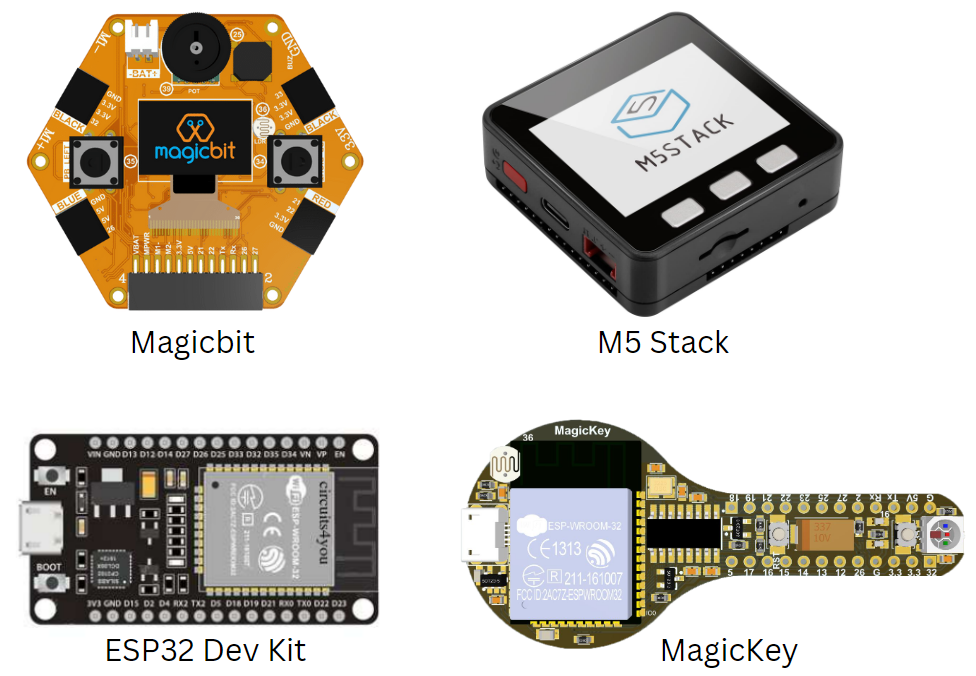
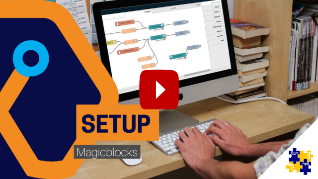
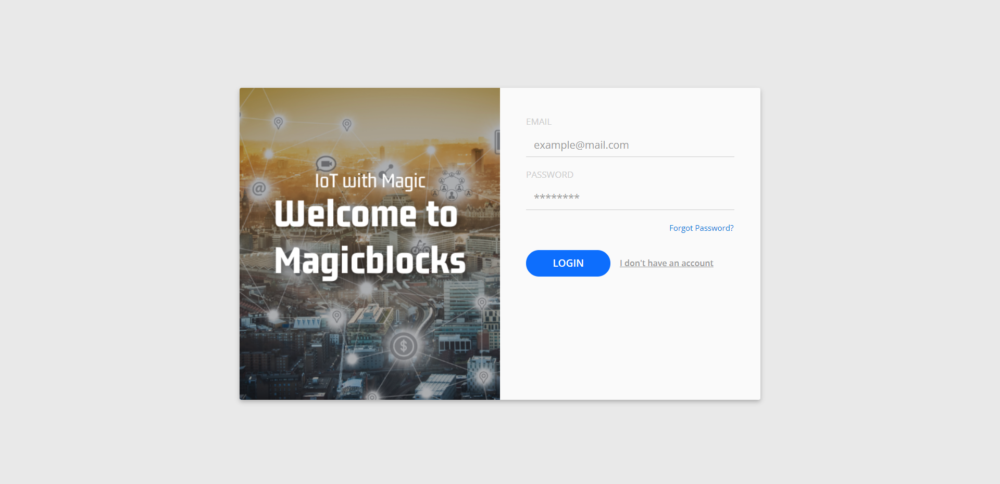
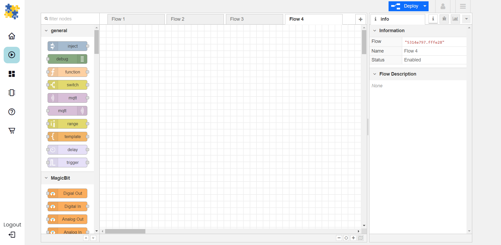

.. tabs::

   .. tab:: Apples

      Apples are green, or sometimes red.

   .. tab:: Pears

      Pears are green.

   .. tab:: Oranges

      Oranges are orange.
      
.. dropdown:: Dropdown title
   Dropdown content

.. raw:: html
       <iframe width="560" height="315" src="https://www.youtube.com/embed/UaIvrDWrIWM" frameborder="0" allowfullscreen></iframe>
      

.. image:: https://img.youtube.com/vi/p4vSKwN1cfI/maxresdefault.jpg
    :alt: Getting Started
    :target: https://www.youtube.com/watch?v=p4vSKwN1cfI 
    :width: 400px

.. contents:: 
    
*****************************************************
What is Internet of Things
*****************************************************

The Internet of Things (IoT) is a network of physical devices, vehicles, buildings, and other items that are embedded with sensors, software, and connectivity, enabling them to collect and exchange data. It allows everyday objects to be connected to the internet and communicate with each other, creating smart systems that can be controlled and monitored remotely. Examples of IoT devices include smart thermostats, refrigerators, door locks, and cameras. Additionally, IoT is used in various industries such as transportation and manufacturing to track vehicles, optimize routes, and monitor machinery performance.
Having an easy way to learn and develop IoT applications is crucial for both students and industry experts. It allows them to quickly prototype and test their ideas, saving time and resources. User-friendly tools such as dashboards make it easier to understand and analyze data from IoT devices, helping to make better decisions and improve the overall performance of the systems. For students, learning about and experimenting with IoT technology can provide hands-on experience and skills that are in high demand in the job market. For industry experts, easy-to-use tools can help them stay competitive in the market and quickly adapt to new technologies.

***************************
What is Magicblocks.io 
***************************

magicbicblocks.io is an easy-to-use IoT platform that supports ESP32-based development boards and utilizes Node-RED, a visual programming tool that allows for drag-and-drop connection of different IoT devices and services, eliminating the need for complex coding. The platform offers pre-built blocks and sample applications, supports a variety of sensors and actuators, and provides cloud-based data storage and remote access. Overall, magicbicblocks.io is a powerful tool for anyone looking to quickly prototype and develop IoT applications.

How Magicblocks works
=============================

The three main components of IoT are devices, cloud, and connectivity. Devices are the physical objects that are embedded with sensors and software that collect and exchange data. Cloud refers to the remote servers where this data is stored and analyzed. Connectivity is the means by which these devices and cloud services communicate, such as Wi-Fi, Bluetooth, or cellular networks. 
In a system using magicblocks, it acts as the cloud component, where data is stored and analyzed. The devices component is fulfilled by using ESP32-based hardware which are embedded with sensors and software. The connectivity method used is WiFi, which enables the communication between the devices and the cloud. Together, these components make it possible to create a smart system that can be monitored and controlled remotely.

Magicblocks.io Playground
=============================

Any ioT creation you want to connect with nodes without any coding and your project running in the cloud platform the development board you use will not have much memory or more processing capability, unless you want to create Image Processing, Character Recognizing, DB Handling, you can create any project on it.

You can also create attractively online dashboards online without any coding

.. image:: Images/playground.png

Magicblocks.io Dashboard
========================

In Magicblocks you can also create Web based-dashboards attractively for your IoT designs without any codes. 
You need to connect the necessary widgets to the dashboard that you want and to configure the settings you need to reach them. 
Then, you can access your Online Dashboard from the dashboard menu on your dashboard, where you can click on the URL in the browser to access the Dashboard via any Device Device such as Smart Phone, Tablet, PC.
Any ioT creation you want to connect with nodes without any coding and your project running in the cloud platform the development board you use will not have much memory or more processing capability, unless you want to create Image Processing, Character Recognizing, DB Handling, you can create any project on it.

You can also create attractively online dashboards online without any coding

.. image:: Images/dashboarde.png

****************
Hardware
****************
The hardware or device component in IoT refers to the physical objects embedded with sensors, software, and connectivity that collect and exchange data, creating smart systems that can be controlled and monitored remotely.

We use ESP32 based hardware for Magicblocks.io. ESP32 is a powerful and versatile microcontroller that is well-suited for IoT projects. Its combination of low cost, small form factor, and built-in wireless capabilities make it an ideal choice for a wide range of applications. And the availability of development boards makes it easy for developers to prototype and test their ideas.
Using ESP32 for IoT projects is a great choice for several reasons:
•	It is low cost, yet powerful enough for many IoT applications.
•	It has built-in wireless capabilities, eliminating the need for separate modules.
•	It has a small form factor, making it easy to integrate into a variety of devices.
•	It has a large and active community of developers, providing a wealth of resources and support.

ESP32 Dev Kit 
=============
ESP32 Dev Kit is a compact development board based on the ESP32 microcontroller, designed for easy prototyping and programming. It has an on-board USB-to-Serial converter and built-in support for a wide range of sensors and actuators. It is a popular development board for IoT projects.

Magicbit
========
Magicbit is an ESP32-based development board that features in-built battery charger, WiFi & Bluetooth connectivity, integrated sensors and actuators, an internal OLED display, and a plug & play feature for easy connection of accessories, enabling users to easily test and design projects.

M5 Stack
========

M5Stack is a line of modular, stackable, and portable development boards based on the ESP32 microcontroller, which are often used for IoT projects and also include additional modules for more functionality.

***************
Getting Started
***************

`Watch Video <https://www.youtube.com/watch?v=p4vSKwN1cfI>`_

Create Magicblocks.io Account
===========================================

- Go to magicblocks website `https://magicblocks.io/ <https://magicblocks.io/>`_

- Select SIGNUP
.. image:: Images/landing%20page.png

- Click on the SIGNUP button after inserted your details

.. image:: Images/signup.png
- Go to the email account you provided and activate your Magicblocks account with the Activation Link

- Follow the Activation Link which we have sent you as an email.

.. image:: Images/verification.png

Login to Your Magicblocks.io Account
=====================================

- Go to Magicblocks.io official website. `https://magicblocks.io/ <https://magicblocks.io/>`_
- Select LOGIN
- Provide your login details.
- Enter your email address and the Magicblocks Password and sign in to magicblocks

Start the Playground
=====================================

The playground is the visual programming environment based on Node-Red that has been customized for seamless integration with hardware devices to enable IoT. When you log in for the first time, your playground will not be running.  If you do not have a valid subscription, you will be allowed to run the playground only for 1 hour continuously before it is automatically stopped. You will need to wait for 1hour to start the playground again. You can subscribe to the Standard Subscription  by entering the coupon code in the Subscription tab provided with your Magicbit device. If you have any issue please write to `info@magicbit.cc <info@magicbit.cc>`_

.. image:: Images/subscription.png

Create a new device
=====================================

Go to Device Manager and add a new device. Select your **device type**  & keep the status as **Active**. You can use any name and description. Click save changes to finish.

.. image:: Images/createadevice.png

Setting up a device
====================
    
        
.. tabs::

    .. tab:: Magicbit

        Connect your device to computer using USB cable.

        .. image:: Images/usb-plugging-magicbit-core.jpg

        click on the setting icon on device manager of your device.

        .. image:: Images/magicblocks-device-setup.jpg

        Select your device and follow instructions to load magicblocks.io firmware.

        .. image:: Images/select-device.jpg

        On next window enter your internet router WiFi network name (SSID) and password

        .. image:: Images/setup-wifi-network.jpg

        On next stage configure the device using USB method. If it didn’t work you can retry again or use WIFi option to configure device. You will get a message after the successful configuration.

        .. image:: Images/configure-wifi.jpg
        
        
    .. tab:: MagicKey

        Connect your device to computer using USB cable.

        .. image:: Images/usb-plugging-magickey.jpg

        click on the setting icon on device manager of your device.

        .. image:: Images/magicblocks-device-setup-magickey.jpg

        Select your device and follow instructions to load magicblocks.io firmware.

        .. image:: Images/select-device-magic-key.jpg

        On next window enter your internet router WiFi network name (SSID) and password

        .. image:: Images/setup-wifi-network-magickey.jpg

        On next stage configure the device using USB method. If it didn’t work you can retry again or use WIFi option to configure device. You will get a message after the successful configuration.

        .. image:: Images/configure-wifi-magickey.jpg

    .. tab:: Generic ESP32

        Connect your device to computer using USB cable.

        .. image:: Images/usb-plugging-ESP32.jpg

        click on the setting icon on device manager of your device.

        .. image:: Images/magicblocks-device-setup-ESP32.jpg

        Select your device and follow instructions to load magicblocks.io firmware.

        .. image:: Images/select-device-ESP32.jpg

        On next window enter your internet router WiFi network name (SSID) and password

        .. image:: Images/setup-wifi-network-esp32.jpg

        On next stage configure the device using USB method. If it didn’t work you can retry again or use WIFi option to configure device. You will get a message after the successful configuration.

        .. image:: Images/configure-wifi-ESP32.jpg

Connect your device to computer using USB cable.

click on the setting icon on device manager of your device.

Select your device and follow instructions to load magicblocks.io firmware.

On next window enter your internet router WiFi network name (SSID) and password

.. image:: Images/setup-wifi-network.jpg

On next stage configure the device using USB method. If it didn’t work you can retry again or use WIFi option to configure device. You will get a message after the successful configuration.

Go to the playground!
=======================

- Login to Magicblocks and click on Playground Button to open the playground. To open the playground you should have started it from the home page.

.. image:: Images/openplayground.PNG

- The playground is a hosted instance of a customized version of the open source Node-Red application. On the left you will find the palette where all the blocks will reside. You can drag and drop the blocks from the palette to the canvas and start rolling very quickly. Once done click the **Deploy** button on the top right corner and all your changes will be saved. In the next section we will go through some examples covering all the relevant blocks

**********
Your first IoT project
**********

Let's start magic with controlling LED over the internet

 Open the Device Manager in your magicblocks account
- Turn on your ESP32 board that was setup in the previous section and wait for it to connect
- Goto the playground
- Drag and drop the **Digital Out** block under the category **Magicbit/ESP32**
- Double click on the block and select device ID
- Set LED connected pin (16 in Magicbit / 2 in ESP32 Dev kit)
- Drag and drop two **inject** blocks under the **input** category and connect them to the **Digital Out** block
- In one **inject** node set payload type as Number and set value to 0
- In Other **inject** node set payload type as Number and set value to 1 
- Click deploy
- Click button in Inject nodes to see the magic. You can control this LED from any where in the world!!!

Watch on Youtube
https://www.youtube.com/watch?v=6y6Ieq8vZbo

.. info::  If you are not familiar with Magicblocks or Nodered you can quickly learn essential features from here. `https://magicbit-magicblocksio.readthedocs.io/en/latest/#playground <https://magicbit-magicblocksio.readthedocs.io/en/latest/#playground>`_

***************
Magicbit Blocks
***************

.. image:: https://github.com/magicbitlk/Magicbit-Magicblocks.io/blob/master/Images/magicbitNodes.PNG?raw=true

Following Blocks are available.
 
-  Digital Out
-  Digital In
-  Analog Out/PWM
-  Analog In
-  Serial Tx
-  Serial Rx
-  Servo
-  Display
-  Buzzer
-  Motor
-  DHT11
-  NeoPixel
-  Ultrasonic
-  IR Read
-  IR Send

This block set enables you to control individual pins of the device from the playground. The functionality of each block is described below:

How Configure Blocks
======================

Every block has a property called Device ID where you need to specify to which device this block belongs to. This is important because you will be working with multiple devices in a typical IoT project. You can find device ID from magicblocks device manager.

Digital Out
-----------

.. image:: https://github.com/magicbitlk/Magicbit-Magicblocks.io/blob/master/Images/digitalOut.PNG?raw=true

This block is used to set a digital output pin to 1 or 0 based on the input. An input of 1 or true will make the configured pin go HIGH and vice versa

- Configuration
    - Pin: pin number of the Digital pin to write to. Available pins can be selected from dropdown list. 
    - Name: Any name desired
- Input
    - value to be written to the pin. Accepts 1 (true) or 0 (false) eg: {"payload": 1} 

Digital In
----------
.. image:: https://github.com/magicbitlk/Magicbit-Magicblocks.io/blob/master/Images/digitalIn.PNG?raw=true

This block will read Input status of a pin. There are two methods to get input 
1. Poll - Block need to triggered to get input status. Any input will serve as a trigger. (eg:inject block)
2. Interrupt - If there is any change of pin state of Magicbit block will output the current state
Input status can be passed to a another block or viewed on the debug window.

- Configuration:
    - Pin: pin number of the digital pin to read .Select from drop down list
    - Name: Any name desired
    - Method: Poll/Interrupt
- Input
    - Any input. Used as a trigger
- Output
    - Value of the pin as 1 or 0 in the following format and the pin number as the topic

Analog Out
----------

.. image:: https://github.com/magicbitlk/Magicbit-Magicblocks.io/blob/master/Images/analogOut.PNG?raw=true

This block used to set PWM to pins of Magicbit. Value should be in range of 0-255. Inject block or output of a another block can be used to set the value.

- Configuration:
    - Pin: pin number of the to set PWM. Select from drop down list
    - Name: Any name desired

- Input
    - Inject block or any block. Input value should be in range of 0-255

Analog In
---------

.. image:: https://github.com/magicbitlk/Magicbit-Magicblocks.io/blob/master/Images/analogIn.PNG?raw=true

This block will read analog value of the ADC pin of the module. Similar to the digital in block you need to set method to read the value. Any input sent to the block will serve as the trigger.
1. Poll - Block need to triggered to get input status. Any input will serve as a trigger. (eg:inject block)
2. Interrupt - If there is any change greater or less than threshold value of Magicbit block will output the analog value

- Configuration:
    - Pin: pin number of the analog pin to read (Required)
    - Name: Any name desired
    - Method: Poll/Interrupt
    - Threshold: If interrupt method selected value return from output if there is any change greater or less than this value

- Input
    - Any input. Used as a trigger
- Output
    - Value of the pin from 0 to 4096 (12bit ADC)  {"payload": 965}

Servo
---------

.. image:: https://github.com/magicbitlk/magicblocks/blob/63dfa1293534a211290852c2194c2a50b02fcc83/Images/Magicblocks%20servo.png

This block will take an input between 0 and 180, and set the servo angle to that position in degrees. 

- Configuration:
    - Name: Any name desired
    - Device ID: Select device from the drop-down menu 
    - Pin: pin number of the Servo (Required)

- Input
    - Integer between 0 and 180.

*************************
Playground 
*************************

.. image:: https://github.com/magicbitlk/Magicbit-Magicblocks.io/blob/master/Images/3-1024x576.jpg?raw=true

The editor window consists of four components:

- The header at the top, containing the deploy button, main menu, and, if user authentication is enabled, the user menu.
- The palette on the left, containing the nodes available to use.
- The main workspace in the middle, where flows are created.
- The sidebar on the right.

.. image:: https://github.com/magicbitlk/Magicbit-Magicblocks.io/blob/master/Images/editor-default-components-1024x683.png?raw=true

The main workspace is where flows are developed by dragging nodes from the palette and wiring them together.
The workspace has a row of tabs along the top; one for each flow and any subflows that have been opened.

Flow
====
.. image:: https://github.com/magicbitlk/Magicbit-Magicblocks.io/blob/master/Images/editor-flow-tabs.png?raw=true

Adding a flow
-------------

To add a new flow, click the 
.. image:: https://github.com/magicbitlk/Magicbit-Magicblocks.io/blob/master/Images/plus.png?raw=true

button in the top bar.

Editing flow properties
-----------------------

To edit a flow’s properties, double-click on its tab in the top bar. This will open the Flow Properties dialog.

Within the dialog, the flow’s name and description can be set. The description can use Markdown syntax for formatting and will appear in the Information sidebar.

The Status property can be used to disable or enable the flow.

.. image:: https://github.com/magicbitlk/Magicbit-Magicblocks.io/blob/master/Images/editor-edit-flow.png?raw=true

Deleting a flow
---------------

To delete a flow, click the ‘Delete’ button in the Flow Properties dialog.

Nodes
======
Nodes can be added to the workspace by either:

- Dragging them from the palette
- Using the quick-add dialog
- Importing from the library or clipboard

Nodes are joined together by wires via their ports. A node can have at most one input port and many output ports. A port may have a label that is displayed when the mouse hovers over it. A node may specify labels, for example, the Switch node shows the rule that matches the port. The labels can also be customised in the node edit dialog.

.. image:: https://github.com/magicbitlk/Magicbit-Magicblocks.io/blob/master/Images/editor-node-port-label.png?raw=true

Some nodes display a status message and icon below the node. This is used to indicate the runtime state of the node - for example, the MQTT nodes indicate if they are currently connected or not.

.. image:: https://github.com/magicbitlk/Magicbit-Magicblocks.io/blob/master/Images/editor-node-details.png?raw=true

If a node has any undeployed changes, it displays a blue circle above it. If there are errors with its configuration, it displays a red triangle.

Some nodes include a button on either its left or right edge. These allow some interaction with the node from within the editor. The Inject and Debug nodes are the only core nodes that have buttons.

Editing node configuration
==========================

A node’s configuration can be edited by double clicking on the node, or pressing **Enter** when the workspace has focus. If multiple nodes are selected, the _first_ node in the selection will be edited.

.. image:: https://github.com/magicbitlk/Magicbit-Magicblocks.io/blob/master/Images/editor-edit-node.png?raw=true

 
.. image:: https://github.com/magicbitlk/Magicbit-Magicblocks.io/blob/master/Images/editor-edit-node-settings.png?raw=true

The node edit dialog has two separate sections; properties and settings. The properties section shows the edit form specific to the node type being edited. The settings section shows the common settings that can be set on all nodes. This includes the custom port labels as well as the icon for the node.

Clicking on the icon shows the Node icon picker that can be used to select the icon for the node from the list of all available icons.

.. image:: https://github.com/magicbitlk/Magicbit-Magicblocks.io/blob/master/Images/editor-edit-node-settings-icon.png?raw=true

Configuration nodes
-------------------

A Configuration (config) Node is a special type of node that holds reusable configuration that can be shared by regular nodes in a flow.

For example, the MQTT In and Out nodes use an MQTT Broker config node to represent a shared connection to an MQTT broker.

Configuration nodes are added through the edit dialog of a node that requires the config node. It will have a field to select from the available config nodes of the required type or to add a new instance.
.. image:: https://github.com/magicbitlk/Magicbit-Magicblocks.io/blob/master/Images/editor-edit-node-config-node.png?raw=true

Clicking the button next to the select box will open the edit dialog for the selected node, or add a new instance.

.. image:: https://github.com/magicbitlk/Magicbit-Magicblocks.io/blob/master/Images/editor-edit-config-node.png?raw=true

The config node edit dialog only has the node properties section - as a config node has no icon or ports to set labels on.

In the footer of the dialog is an indication of how many nodes use this config node. It also provides a select box to set the scope of the config node. The scope determines which flows the config node is available on. By default it is available on all flows, but the select box can be used to make it local to just one flow.

The Configuration Nodes Sidebar can be used to manage all config nodes.

Wires
=====

Nodes are wired together by pressing the left-mouse button on a node’s port, dragging to the destination node and releasing the mouse button.

.. image:: https://github.com/magicbitlk/Magicbit-Magicblocks.io/blob/master/Images/editor-node-wire.png?raw=true

Alternatively, if the **Ctrl/Command** key is held down, the left-mouse button can be clicked (and released) on a node’s port and then clicked on the destination. If the **Ctrl/Command** key remains held and the just-wired destination node has an output port, a new wire is started from that port. This allows a set of nodes to be quickly wired together.

This can also be combined with the Quick-Add dialog that is triggered by a **Ctrl/Command-Click** on the workspace to quickly insert new nodes and have them already wired to previous nodes in the flow.

Splitting wires
---------------

If a node with both an input and output port is dragged over the mid-point of a wire, the wire is draw with a dash. If the node is then dropped, it is automatically inserted into the flow at that point.

.. image:: https://github.com/magicbitlk/Magicbit-Magicblocks.io/blob/master/Images/editor-wiring-splice.png?raw=true

Moving wires
------------

To disconnect a wire from a port, select the wire by clicking on it, then press and hold the **Shift** key when the left-mouse button is pressed on the port. When the mouse is then dragged, the wire disconnects from the port and can be dropped on another port. If the mouse button is released over the workspace, the wire is deleted.

If a port has multiple wires connected to it, if none of them is selected when button is pressed with the **Shift** key held, all of the wires will move.

Deleting wires
--------------

To delete a wire, first select it by clicking on it and then press the **delete** key.

Selection
=========
A node is selected when it is clicked on. This will deselect anything currently selected. The Information Sidebar will update to show the node’s properties and help text for its type.

If the **Ctrl** or **Command** key is held when clicking on the node, the node will be added to the current selection (or removed if it was already selected).

If the **Shift** key is held when clicking on the node, it will select that node and all other nodes it is connected to.

A wire is selected when it is clicked on. Unlike nodes, it is only possible to select one wire at a time.

Lasso Tool
----------

The lasso tool can be used to select multiple nodes. It is enabled by click-dragging on the workspace.

It cannot be used to select a wire.

.. image:: https://github.com/Magicblocks/magicblocks.io/blob/master/Images/editor-workspace-lasso.png?raw=true

Selecting all nodes
-------------------
To select all nodes on the current flow, ensure the workspace has focus and then press **Ctrl/Command-a**.

Editor clipboard
----------------

The editor supports the standard copy/cut/paste actions. Note they use an internal clipboard rather than the system clipboard.

Import & Export
===============

Flows can be imported and exported from the editor using their JSON format, making it very easy to share flows with others.

Importing flows
---------------

To import a flow, open the Import dialog, paste in the flow json and click ‘Import’.

The ‘Import’ button will only be active if valid JSON is pasted into the dialog.

The dialog also offers the option to import the nodes into the current flow, or to create a new flow for them.

.. image:: https://github.com/Magicblocks/magicblocks.io/blob/master/Images/editor-import.png?raw=true

Exporting flows
---------------

The Export dialog can be used to copy flow json out of the editor.

It can export either the selected nodes, the current flow (including its tab node) or the complete flow configuration.

It offers the option to export compact or formatted JSON. The compact option generates a single line of JSON with no whitespace. The formatted JSON option is formatted over multiple lines with full indentation - which can be easier to read.

.. image:: https://github.com/Magicblocks/magicblocks.io/blob/master/Images/editor-export.png?raw=true
**********
Dashboards
**********

What is Magicblocks Dashboard?
==============================

**Magicblocks** Dashboard is a module that provides a set of nodes in **Magicblocks** to quickly create a live data dashboard.

Since **Magicblocks** is based on NODE-RED opensource platform you can learn more about dashboard using following links

- http://flows.nodered.org/node/node-red-dashboard
- https://github.com/node-red/node-red-dashboard

.. image:: https://github.com/magicbitlk/Magicbit-Magicblocks.io/blob/master/Images/dashboard_nodes.png?raw=true

Nodes from the dashboard section provide widgets that show up in your application user interface (UI).

The user interface is organized in tabs and groups. Tabs are different pages on your user interface, like several tabs in a browser. Inside each tab you have groups that divide the tabs in different sections so that you can organize your widgets.

Every widget should have an associated group that determines where the widget should appear on the user interface.

To create a tab and a group follow the following instructions (see figure below):

* On top right corner of the **Magicblocks** window you have a tab called dashboard.
* Select that tab **(1)**. To add a tab to the user interface click on the +tab button **(2)**.
* Once created, you can edit the tab by clicking on the edit button **(3)**

.. image:: https://github.com/magicbitlk/Magicbit-Magicblocks.io/blob/master/Images/dashboard_and_nodes.PNG?raw=true

**You can edit the tab’s name and change its icon**

- Name: you can call it whatever you want
- Icon:  you should use a name accordingly to the icon’s names in this link: https://klarsys.github.io/angular-material-icons

.. image:: https://github.com/magicbitlk/Magicbit-Magicblocks.io/blob/master/Images/edit-tab.png?raw=true

- After creating a tab, you can create several groups under that tab. You need to create at least one group to add your widgets. To add a group to the created tab, you need to click on the +group button **(4)**.

- Then, you can edit the created group by clicking on the edit button **(5)**.

.. image:: https://github.com/magicbitlk/Magicbit-Magicblocks.io/blob/master/Images/group-properties.png?raw=true

- You can edit its name, select its corresponding tab and change its width.

Dashboard Theme
==============================

The **Magicblocks** Dashboard has a white background and a light blue bar by default. You can edit its colors in the Theme tab on the up right corner as show in the following figure.

.. image:: https://github.com/magicbitlk/Magicbit-Magicblocks.io/blob/master/Images/theme-properties.png?raw=true

- Change the style, deploy the changes and see the Dashboard UI changing its colors. For example, like in the following figure

.. image:: https://github.com/magicbitlk/Magicbit-Magicblocks.io/blob/master/Images/Dashboard.PNG?raw=true

Dashboard Site
==============================

At the right upper corner of the **Magicblocks** window, you have another tab called Site that allows you to do further customization as show in the figure below.

.. image:: https://github.com/magicbitlk/Magicbit-Magicblocks.io/blob/master/Images/site-properties.png?raw=true

Feel free to change the settings, then deploy the changes and see how the UI looks. At the moment you won’t see much difference because you haven’t added anything to the dashboard yet. Those changes will be noticeable when you start adding widgets to the UI.

Creating a User Interface – Example
==============================

In this section we’re going to make a dashboard example to show you how you can build and edit your own dashboard – we won’t actually add functionalities to the widgets – we’ll do that in future projects. This dashboard will have the following features

- Two different tabs: one called Room and another called Garden
- The Room tab will have two groups and the Garden tab will have one group
- We’ll add a color picker and a switch to the room groups
- We’ll add a chart to the Garden group

Creating the Tabs
==============================

On the top right corner on the Magicblocks window, select the **dashboard** tab and create two new tabs by clicking on the **+tab** button.

Edit one tab with the following properties

- **Name:** Room
- **Icon:** tv

And the other one with the following

- Name: Garden
- Icon: local_florist

Then, add two groups to the Room tab and one group to the Garden tab. The following figure shows how your dashboard layout looks.

.. image:: https://github.com/magicbitlk/Magicbit-Magicblocks.io/blob/master/Images/dashboard-layout.png?raw=true

Adding the Widgets
==============================

Add a switch, a slider, a colour picker and a gauge to the flow as show in the following figure
.. image:: https://github.com/magicbitlk/Magicbit-Magicblocks.io/blob/master/Images/flow.png?raw=true

Double click on the switch. A new window pops up.

.. image:: https://github.com/magicbitlk/Magicbit-Magicblocks.io/blob/master/Images/switch.png?raw=true

In this new window you can choose where you want your button widget to appear. In this case we want it to appear in the Room tab, Group 1 as highlighted in red in the previous figure.

Then, do the same for the other widgets but add them to the following groups:

- **slider:** Group 1 [Room]
- **color picker:** Group 2 [Room]
- **gauge:** Group 1 [Garden]

Source: (https://randomnerdtutorials.com/getting-started-with-node-red-dashboard/)

***********
Core Blocks
***********

The Magicblocks palette includes a default set of nodes that are the basic building blocks for creating flows. This page highlights the core set you should know about.

All nodes include documentation you can see in the Info sidebar tab when you select a node.

- Inject
- Debug
- Function
- Change
- Switch
- Template

Inject node
==========

.. image:: https://github.com/magicbitlk/Magicbit-Magicblocks.io/blob/master/Images/node_inject.png?raw=true

The Inject node can be used to manual trigger a flow by clicking the node’s button within the editor. It can also be used to automatically trigger flows at regular intervals.

The message sent by the Inject node can have its **payload** and **topic** properties set.

The **payload** can be set to a variety of different types:

- a flow or global context property value
- a String, number, boolean, Buffer or Object
- a Timestamp in milliseconds since January 1st, 1970

Debug node
===========
.. image:: https://github.com/magicbitlk/Magicbit-Magicblocks.io/blob/master/Images/node_debug.png?raw=true

The Debug node can be used to display messages in the Debug sidebar within the editor.

The sidebar provides a structured view of the messages it is sent, making it easier to explore the message.

Alongside each message, the debug sidebar includes information about the time the message was received and which Debug node sent it. Clicking on the source node id will reveal that node within the workspace.

The button on the node can be used to enable or disable its output. It is recommended to disable or remove any Debug nodes that are not being used.

The node can also be configured to send all messages to the runtime log, or to send short (32 characters) to the status text under the debug node.

The page on Working with messages gives more information about using the Debug sidebar.

Function node
==============

.. image:: https://github.com/magicbitlk/Magicbit-Magicblocks.io/blob/master/Images/node_function.png?raw=true

The Function node allows JavaScript code to be run against the messages that are passed through it.

A complete guide for using the Function node is `available here <https://nodered.org/docs/user-guide/writing-functions>`_
.

Change node
==========

.. image:: https://github.com/magicbitlk/Magicbit-Magicblocks.io/blob/master/Images/node_change.png?raw=true

The Change node can be used to modify a message’s properties and set context properties without having to resort to a Function node.

Each node can be configured with multiple operations that are applied in order. The available operations are:

- **Set** - set a property. The value can be a variety of different types, or can be taken from an existing message or context property.
- **Change** - search and replace parts of a message property.
- **Move** - move or rename a property.
- **Delete** - delete a property.
- **When** setting a property, the value can also be the result of a JSONata expression. JSONata is a declarative query and transformation language for JSON data.

Switch node
===========

.. image:: https://github.com/magicbitlk/Magicbit-Magicblocks.io/blob/master/Images/node_switch.png?raw=true

The Switch node allows messages to be routed to different branches of a flow by evaluating a set of rules against each message.

The node is configured with the property to test - which can be either a message property or a context property.

There are four types of rule:

- **Value** rules are evaluated against the configured property
- **Sequence** rules can be used on message sequences, such as those generated by the Split node
- A JSONata **Expression** can be provided that will be evaluated against the whole message and will match if the expression returns a _true_ value.
- An **Otherwise** rule can be used to match if none of the preceding rules have matched.
The node will route a message to all outputs corresponding to matching rules. But it can also be configured to stop evaluating rules when it finds one that matches.

